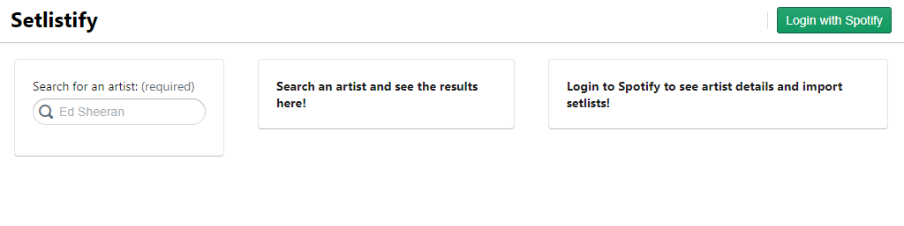
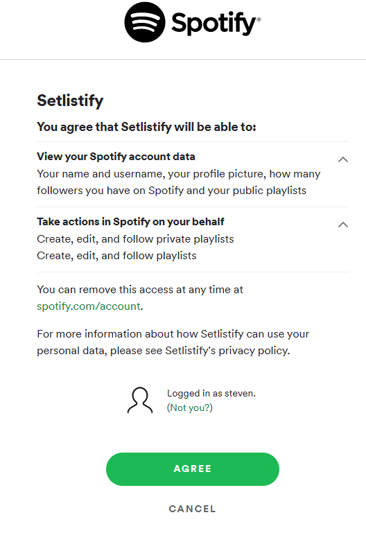
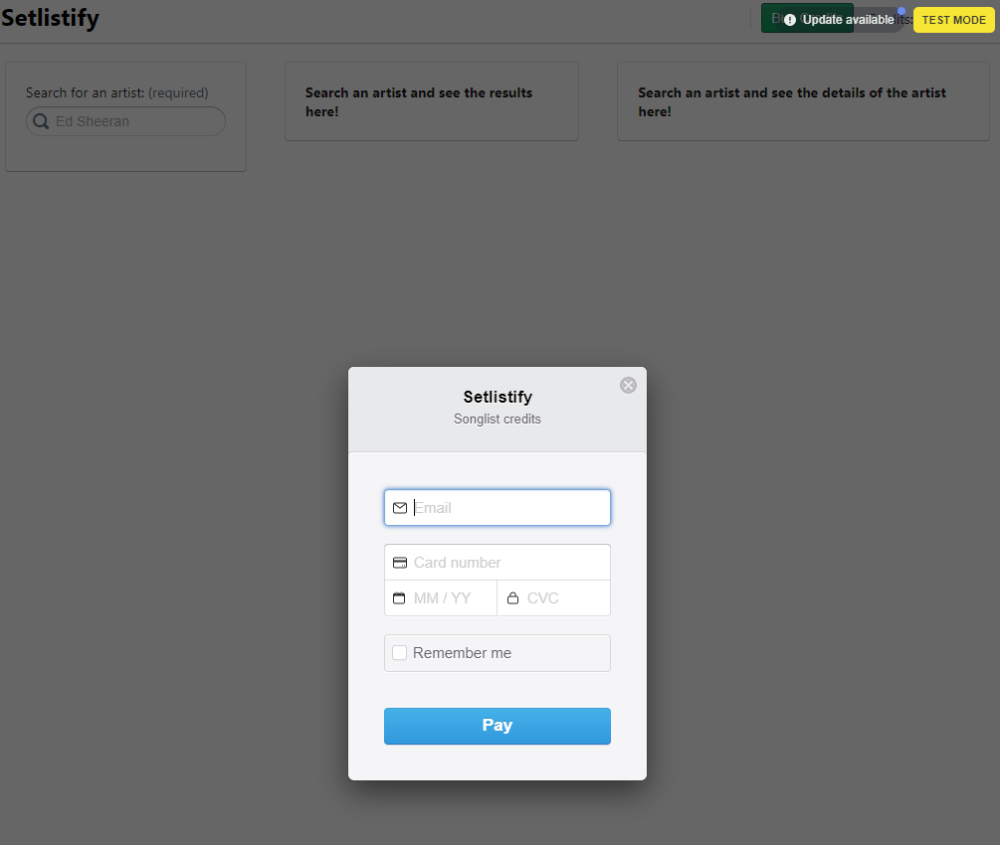
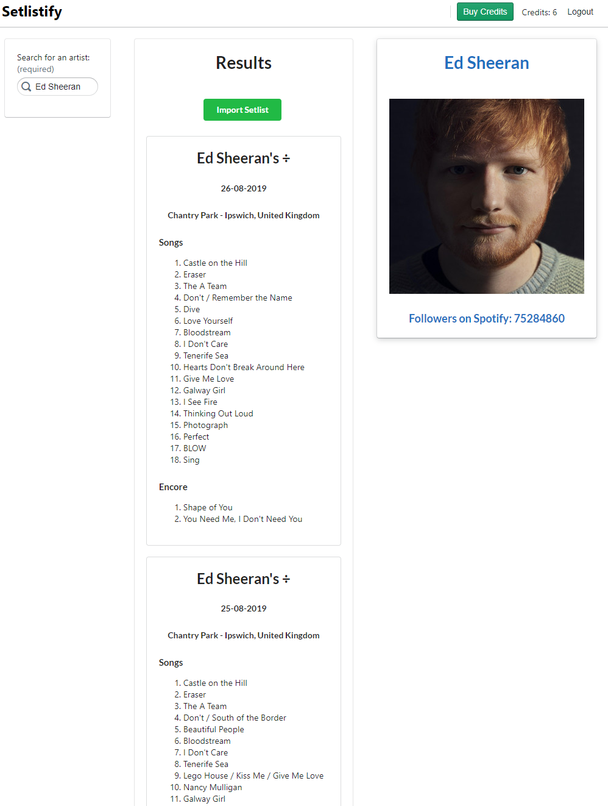
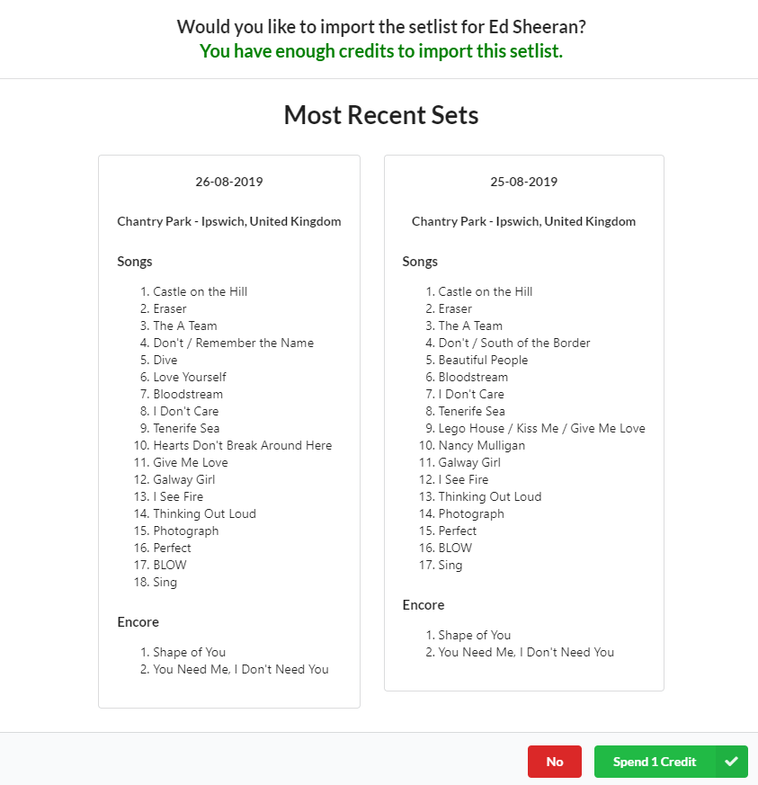
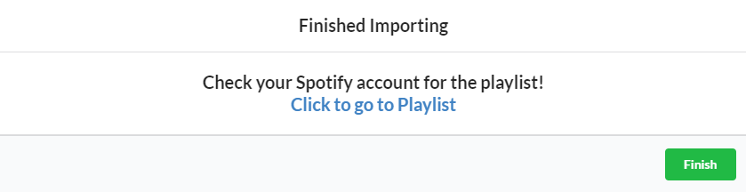

# Setlistify

Setlistify is a full-stack single page web application where users can import setlists to their Spotify account through playlists.

The frontend uses React Hooks and Redux to manage global state.

[Deployed site](http://setlistify-prod.herokuapp.com)

## Packages Used
### Server

1. Body Parser (Accessing post data through the body)
2. Cookie Session (managing cookie-based user sesions)
3. Express (Node framework that helps with routing)
4. Mongoose (MongoDB support)
5. Passport / Passport Spotify (Authenticiation using OAuth 2.0 API with Spotify)
6. Stripe (billing management)

### Client
1. Blueprint (React UI Framework for styling)
2. HTTP-Proxy-Middleware (useful for connecting server to client on localhost)
3. React Debounce Input - (used for searching and preventing excessive calls to the server)
4. React Redux (managing global state)
5. Redux Thunk (applying async logic for dispatching to Redux store)
6. React Stripe Checkout (billing management)

## Running Locally
At the root of the project, you should have a dev-sample.js to show the structure of the dev.js file

```js
module.exports = {
  spotifyClientID: "",
  spotifyClientSecret: "",
  mongoURI: "",
  cookieKey: "",
  stripePublishableKey: "",
  stripeSecretKey: "",
  setlistKey: "",
};
```

Create and fill the dev.js file with the appropriate keys and run with ```npm run dev``` to start the server and client. To add credits: login and use the test mode credentials of: any email, card number - ```4242 4242 4242 4242```, any future date, any CVC.

## Screenshots

### Home 


### Spotify Login


### Adding Credits


### Searching for an Artist


### Recent Setlists


### Creating a Spotify Playlist


## Old Code
Refactored class based components from: https://github.com/stevenlay/setlistify_server

Plain JavaScript from: https://github.com/stevenlay/setlist.fm-Spotify-Playlist
